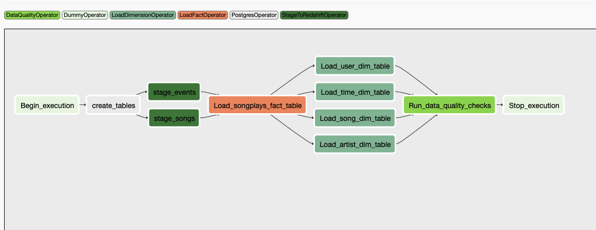

# Airflow Deployment

## Introduction
This project builds a DWH Redshift cluster in AWS, builds a Docker based airflow deployment locally on your machine and, finally Airflow Data pipelines that can be run through 'DAGs'. Under `/terraform` directory the infrastructure as code is defined. In `dags` directory the DAG is defined and under `operators` several different operators for Airflow are defined.

## Data & Files 

### DATA
The data that will be loaded from S3 resides here:
- Song data: `s3://udacity-dend/song_data`
- Log data: `s3://udacity-dend/log_data`
- Log data json path: `s3://udacity-dend/log_data`

The first dataset is a subset of real data from the Million Song Dataset. Each file is in JSON format and contains metadata about a song and the artist of that song. The files are partitioned by the first three letters of each song's track ID. For example, here are filepaths to two files in this dataset.

Typical example of the data:
```{"num_songs": 1, "artist_id": "ARJIE2Y1187B994AB7", "artist_latitude": null, "artist_longitude": null, "artist_location": "", "artist_name": "Line Renaud", "song_id": "SOUPIRU12A6D4FA1E1", "title": "Der Kleine Dompfaff", "duration": 152.92036, "year": 0}```

The second dataset consists of log files in JSON format generated by this event simulator based on the songs in the dataset above. These simulate app activity logs from an imaginary music streaming app based on configuration settings.

### Python Files
- dags/airflow_dag.py: this python file defines the data pipeline. Each step is defined by an Airflow operator. 
- plugins/operators/data_quality.py: this python file runs data quality checks after the full pipeline has run
- plugins/operators/load_dimension.py: this python file inserts the dimension tables as per below defined data schema
- plugins/operators/load_fact.py: this python file insers the fact table as per below defined data schema
- plugins/operators/stage_redshift.py: this python file stages the data from S3 into Redshift tables
- helpers/sql_queries.py: this python file defines the SQL queries for each of the operators

### IaC files for DWH
- terraform/*: IaC terraform files in this directory create the IAM role and the actual Redshift DWH 

## Airflow Data Pipeline overview
The airflow pipeline inititally creates the tables, based on the `create_tables.sql` file. Then the pipeline continues to stage the data, 
loads the fact tables, then loads the dimension tables, and finally runs a few data quality checks. 


## Schema for DWH 
In this section the schema's for the database are explained. 

### Fact Table
1. songplays - records in log data associated with song plays i.e. records with page `NextSong`
   - `songplay_id`, `start_time`, `user_id`, `level`, `song_id`, `artist_id`, `session_id`, `location`, `user_agent`

### Dimension Tables
2. users - users in the app
   - `user_id`, `first_name`, `last_name`, `gender`, `level`
3. songs - songs in music database
   - `song_id`, `title`, `artist_id`, `year`, `duration`
4. artists - artists in music database
   - `artist_id`, `name`, `location`, `latitude`, `longitude`
5. time - timestamps of records in songplays broken down into specific units
   - `start_time`, `hour`, `day`, `week`, `month`, `year`, `weekday`
